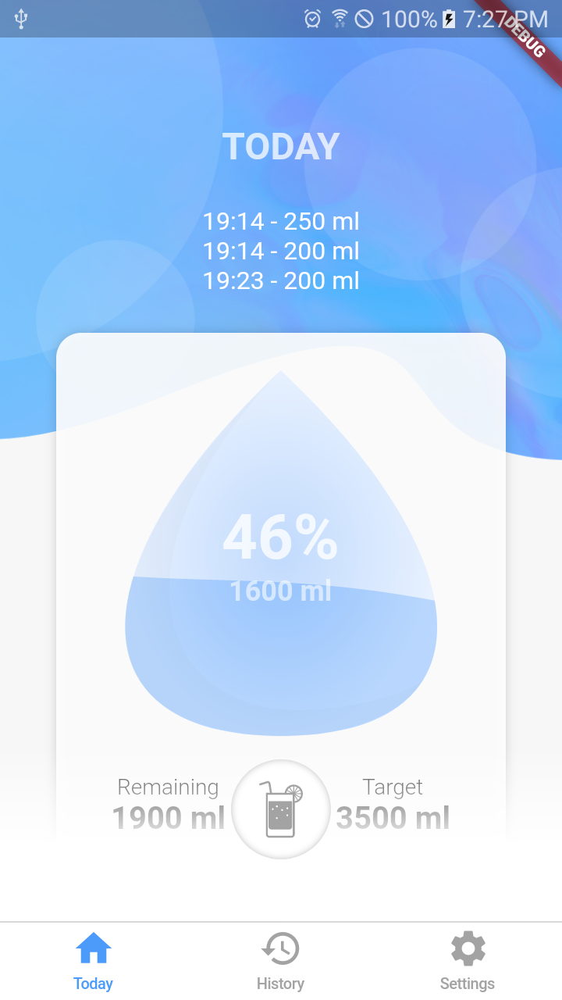
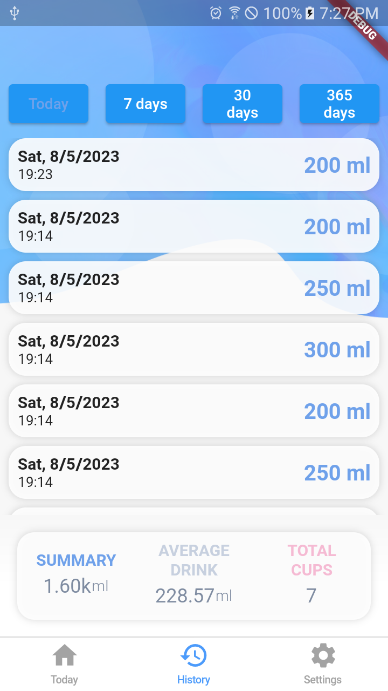
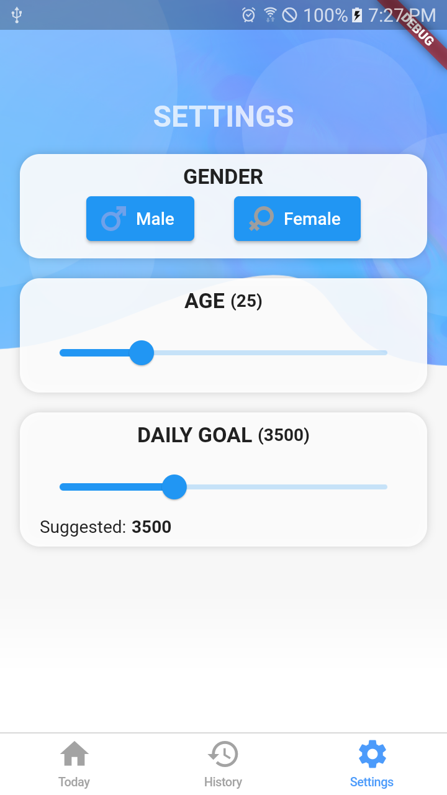

# Water
A Flutter project to track water drinking.

## Features

- Beautiful minimal UI
- Display drank water
- Set daily target to amount of water to be drunk
- Show history of drink water

## Screenshots

<table>

  <tr> 
    <td>   </td>
    <td>   </td>
    <td>   </td>
  </tr>

</table>